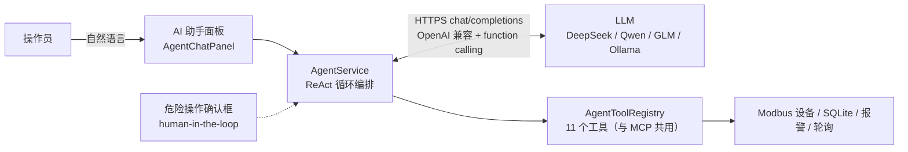

# FieldLink 内嵌 AI 助手使用指南

> 分支：`agent` ｜ 设计文档：[AI_AGENT_MCP_DESIGN.md](AI_AGENT_MCP_DESIGN.md) ｜ MCP 侧：[MCP_GUIDE.md](MCP_GUIDE.md)
>
> 本分支实现了**内嵌 AI Agent**：程序内置聊天面板，LLM 通过 Function Calling
> 调用 FieldLink 自身能力（读寄存器、查历史、配报警……），危险操作弹窗人工确认。

---

## 一、架构与数据流



**工具注册表与 mcp 分支共用**：`AgentToolRegistry` 里的 11 个工具（`get_system_status`、
`read_registers`、`write_registers`、`query_history`、`add_alarm_rule`、`polling_control` 等）
定义一次，MCP 出口和内嵌助手出口同时使用。

## 二、快速开始

1. 菜单 **Advanced → AI Assistant (Chat)** 打开聊天窗口
2. 配置 LLM 服务（三选一，填完点「保存配置」）：

| 服务 | 服务地址 | API Key | 模型 |
| --- | --- | --- | --- |
| DeepSeek | `https://api.deepseek.com/v1` | 平台申请 | `deepseek-chat` |
| 通义千问 | `https://dashscope.aliyuncs.com/compatible-mode/v1` | 平台申请 | `qwen-plus` |
| 本地 Ollama | `http://127.0.0.1:11434/v1` | 留空 | `qwen2.5:7b` 等 |

3. 对话测试（建议先连接 Modbus 模拟器，见 [TESTING_GUIDE.md](TESTING_GUIDE.md)）：
   - 「现在系统什么状态？」→ 自动调用 `get_system_status`
   - 「读一下 1 号设备保持寄存器 0 到 4」→ `read_registers`
   - 「把保持寄存器 10 写成 1234」→ **弹窗确认** → 批准后写入并回读
   - 「过去一小时数据有什么趋势？」→ `query_history`

## 三、Agent 循环（工作原理）

1. 用户输入 + 系统提示词 + 工具清单（JSON Schema）→ 请求 LLM
2. LLM 返回 `tool_calls`（工具名 + JSON 参数）
3. 三道闸门：**参数 Schema 校验**（AgentToolRegistry）→ **危险工具确认框** → 执行
4. 结果以 `role:"tool"` 回填，LLM 继续推理；可多轮调用（上限 8 轮防失控）
5. 最终文本回答流式显示到面板

聊天视图中工具调用过程全程可见（紫色工具调用行 + 绿色/红色结果行）。

## 四、安全设计

- **危险工具确认框**：`write_registers` / `add_alarm_rule` / `polling_control` 调用前
  弹窗显示工具名+完整参数，本机操作员点「Yes」才执行；`ai/writeConfirmation` 可关闭（不建议）
- **全量审计**：写操作经由 SecurityManager 审计日志
- **参数校验**：所有工具参数按 JSON Schema 强校验，不合法直接拒绝并让模型自纠
- **轮次上限**：单次提问最多 8 轮工具调用，防止模型失控循环
- **密钥存储**：API Key 保存在本地 QSettings（`ai/apiKey`），不上传；内网可用 Ollama 免密钥

## 五、离线测试（无需真实 LLM 服务）

仓库附带 Mock LLM 服务器 `deploy/mock_llm_server.py`（纯标准库），脚本化模拟
"第 1 轮下发工具调用 → 第 2 轮给出最终回答"的完整循环，并校验请求形状：

```powershell
# 终端 1：启动 mock
python deploy\mock_llm_server.py --port 11890

# 聊天面板配置：服务地址 http://127.0.0.1:11890/v1，密钥留空，模型 mock-model
# 输入任意消息 → mock 会让 AI 调用 get_system_status → 再返回最终回答
```

## 六、已知边界（v1）

- LLM 请求为**非流式**（等待完整回答后一次性显示）；流式输出可后续迭代
- QoS/重试：请求超时 120 秒，失败以错误行显示，可重发
- 会话历史保存在内存（关闭程序即清空），可后续持久化

---

*协议参考：OpenAI Chat Completions（tool calling）；工具注册表设计见设计文档第三节。*
