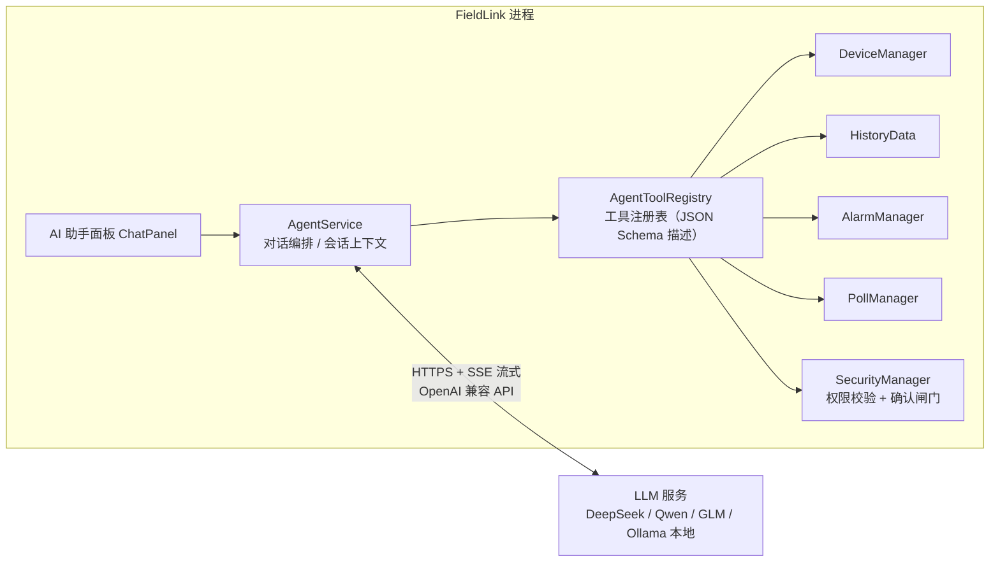

# FieldLink AI 能力集成方案（AI Agent + MCP）

> 状态：设计稿 v0.1（仅思路，不含代码实现）
> 目标读者：本项目开发者；也适合作为 AI Agent 学习路线的实践载体

---

## 一、结论先行

**完全可行，而且这个项目的先天条件非常好。** 有两条互补的路线：

| 路线 | 内容 | 改动量 | 学习价值 |
| --- | --- | --- | --- |
| **A. 内嵌 AI Agent** | 在 FieldLink 界面里内置一个智能助手面板，LLM 通过 Function Calling 调用软件自身能力（读寄存器、查历史、配报警……） | 中（新增 Qt 模块） | ⭐⭐⭐⭐⭐ Agent 循环、工具设计、结构化输出 |
| **B. 接入 MCP Server** | 把 FieldLink 的能力暴露为 MCP 工具，让 Claude Desktop / Cursor 等现成 AI 客户端直接操控采集系统 | B1 零 C++ 改动 / B3 中等 | ⭐⭐⭐⭐ MCP 协议、生态互联 |

**推荐路径：先 B 后 A。** 原因：项目已有 HTTP JSON API（`RemoteServer`），做一个外部 MCP 桥接进程当天就能跑通，先用最小代价理解 MCP；然后再回到 Qt 里做真正的 Agent 模块（路线 A），那才是 agent 开发的主战场。

**一个关键设计决策：路线 A 和 B 共用同一份"工具注册表"。** 工具定义写一次，既给内嵌 Agent 用，也给 MCP Server 用——这是整个方案的架构核心。

---

## 二、为什么 FieldLink 特别适合加 AI Agent

一个练手 agent 项目最重要的是**有真实、丰富、安全的工具可调**。本项目恰好全占：

1. **工具天然丰富**：每个现有 Manager 就是一个现成的 Tool——
   `DeviceManager`（连接管理）、`PollManager`（轮询）、`HistoryData`（历史查询）、
   `AlarmManager`（报警规则）、`DataExporter`（导出）、`BatchTaskManager`（批量任务）……
2. **安全护栏是现成的**：`SecurityManager` 已有用户/角色/权限模型和 API Token 哈希，`ensurePermission()` 校验模式已经在用；远程写还有独立开关。AI 的"危险操作需管控"问题有现成答案。
3. **AI 进出通道已存在**：`RemoteServer` 已经实现了 HTTP JSON API（status / read / write + Token 鉴权），MCP 桥接可以直接搭在这上面。
4. **数据闭环完整**：采集 → SQLite 存储 → 报警 → 导出，LLM 有真实上下文可分析，不是玩具 demo。
5. **插件系统兜底**：`plugininterface.h` 有 `onDataReceived` / `onConnectionStateChanged` 回调，未来甚至可以把 AI 分析器做成插件。

---

## 三、路线 A：内嵌 AI Agent 助手

### 3.1 总体架构



### 3.2 Agent 运行循环（Function Calling / ReAct）

1. 用户在聊天面板输入（如"帮我看下 1 号设备最近一小时 40001 的温度趋势"）
2. `AgentService` 组装：系统提示词 + 对话历史 + **工具清单（名称/描述/参数 JSON Schema）**，请求 LLM
3. LLM 返回 `tool_call`：工具名 + 参数 JSON
4. `AgentService` 三道闸门：**参数 Schema 校验 → 权限校验（复用 `ensurePermission`）→ 危险操作弹确认框**
5. 执行工具，把结果（JSON 文本）作为 tool 结果回传 LLM
6. LLM 继续推理：可能再调工具（多轮循环），也可能直接生成自然语言回答
7. 回答流式渲染到面板；整个循环对用户透明可见（显示"正在调用：查询历史数据…"）

这就是最经典的 agent loop，工业软件里做它比做聊天机器人更有意思，因为工具全是真家伙。

### 3.3 工具清单（映射到现有模块）

| 工具名 | 背后的现有能力 | 风险等级 | 是否需人工确认 |
| --- | --- | --- | --- |
| `get_system_status` | `MainWindow::buildRemoteStatus()` | 只读 | 否 |
| `list_devices` / `get_device_config` | `DeviceManager::allDevices()` | 只读 | 否 |
| `read_registers` | Modbus 读（经 `DeviceManager`/`PollManager`） | 只读 | 否 |
| `query_history` | `HistoryData::query()` | 只读 | 否 |
| `get_statistics` | 历史数据聚合（可新增统计方法） | 只读 | 否 |
| `get_alarm_rules` / `get_alarm_history` | `AlarmManager` | 只读 | 否 |
| `export_data` | `DataExporter::exportToCsv()` | 低 | 否 |
| `run_diagnostics` | `ReliabilityManager` 状态 + Modbus 异常码汇总 | 只读 | 否 |
| `add/update_alarm_rule` | `AlarmManager` 写 | **写** | **是** |
| `write_registers` | Modbus 写 | **危险** | **是 + 权限 + 可全局禁用** |
| `start/stop_polling` | `PollManager` | **写** | **是** |

设计要点：
- **工具描述写好 = agent 成功的一半**。每个工具的 description 和参数 Schema 要站在 LLM 视角写清楚"什么时候该用我、参数什么含义、返回什么结构"。
- 返回值统一为"摘要 + 结构化 JSON"，既省 token 又方便 LLM 推理。

### 3.4 安全护栏（工业场景的一票否决项）

- **写操作一律 human-in-the-loop**：agent 只能"提出"写请求，用户在确认卡片上看到解析后的完整参数（设备/地址/值）才放行；`write_registers` 还受全局开关控制（复用远程写开关的思路）
- **权限继承**：AI 以当前登录用户的身份行事，`SecurityManager` 里 operator 没有的权限，agent 也没有——AI 不提权
- **全量审计**：agent 触发的每个工具调用（含参数与结果摘要）写入日志，`LogViewer` 可查
- **Dry-run 模式**：所有写工具支持"只解析不执行"的演练模式，教学/演示场景安全

### 3.5 Qt 侧技术要点

- **LLM 接入**：`QNetworkAccessManager` 走 **OpenAI 兼容协议**（`/v1/chat/completions`），DeepSeek / 通义千问 / GLM / 本地 Ollama 全都兼容这个格式——provider 做成配置项，一套代码随便切
- **流式输出**：解析 SSE（`data: {...}` 行），Qt 5.15 的 `QNetworkReply` 增量读取即可
- **结构化输出**：工具参数用 JSON Schema 描述 + `QJsonDocument` 解析校验，非法参数拒绝执行并回传错误给 LLM 让它自纠
- **上下文管理**：会话历史截断/摘要策略，控制 token 预算；工具结果太长时只回传聚合摘要
- **离线场景**：工业内网常见无外网，配置 Ollama 本地模型作为兜底（这正是 OpenAI 兼容协议的好处）
- **新增文件建议**（将来动手时）：`header/agent_service.h`、`header/agent_tool.h`、`src/agent_service.cpp`…，完全融入现有 `src/` + `header/` 结构

---

## 四、路线 B：接入 MCP（Model Context Protocol）

### 4.1 MCP 是什么（30 秒版）

MCP 是 Anthropic 发起、已被 OpenAI/Google 等跟进的开放标准，让 AI 客户端（Claude Desktop、Cursor 等）以统一协议发现并调用外部工具。核心概念：

- **传输层**：JSON-RPC 2.0；本地用 `stdio`，远程用 `Streamable HTTP`（2025-03-26 规范引入，取代旧的 HTTP+SSE，见 [MCP Transports 规范](https://modelcontextprotocol.io/specification/2025-06-18/basic/transports)）
- **能力模型**：Server 对外暴露 **Tools**（可调用操作）/ **Resources**（可读数据）/ **Prompts**（预设提示词）
- 对 FieldLink 来说：把"读寄存器、查历史、加报警规则"注册成 MCP Tools，Claude Desktop 就变成了这个工业系统的自然语言操作台

### 4.2 方案 B1：外部 stdio 桥接（推荐起步，零 C++ 改动）

```
Claude Desktop ⇄ (stdio) ⇄ MCP 桥接进程(Python/Node) ⇄ (HTTP+Token) ⇄ FieldLink RemoteServer
```

- 桥接进程用官方 Python/Node MCP SDK 写，把 FieldLink 已有的 HTTP API 逐个包装成 MCP Tool
- FieldLink 一行代码不用改，一天内可跑通
- 局限：依赖 FieldLink 正在运行；桥是"第二份工具定义"，与路线 A 的注册表有重复（起步期可接受）

### 4.3 方案 B2：C++ 原生 MCP Server（进阶）

- 在 `RemoteServer` 上新增 `/mcp` 端点，实现 Streamable HTTP 传输下的 `initialize` / `tools/list` / `tools/call` 三个核心方法
- **工具定义直接复用路线 A 的 `AgentToolRegistry`**——一份工具，两个出口（内嵌面板 + MCP）
- 社区已有 C++ SDK 可参考（如 [mcpp](https://github.com/KotDath/mcpp)），但基于 Qt 自研一套轻量实现反而更贴合现有代码风格，学习价值也最大
- 鉴权：MCP over HTTP 场景配合现成的 Token 机制即可起步

### 4.4 MCP 暴露哪些东西

- **Tools**：与 3.3 工具清单完全一致（这就是共用注册表的意义）
- **Resources**：设备配置、报警规则表、最近 N 条历史——供 AI 客户端按需读取
- **Prompts**：预置"日报生成""故障排查""报警规则体检"三个模板提示词，用户在 Claude 里一键调用

---

## 五、路线 A 之外的两个"轻 AI"加分项

不建 Agent 也能立刻加的 AI 功能（工作小时级）：

1. **报警智能解读**：报警触发时，把报警事件 + 最近上下文数据交给 LLM，生成一段根因分析建议，显示在报警详情里（复用 `AlarmManager` 事件流）
2. **AI 日报/周报**：基于 `HistoryData` 统计 + 报警统计自动生成运行报告文本（复用 `DeliveryManager` 已有的报告生成思路）

这两项是"单次调用无循环"，实现最简单，适合作为热身。

---

## 六、分阶段落地路线图

| 阶段 | 内容 | 产出 | 预估 |
| --- | --- | --- | --- |
| P0 | B1 外部 MCP 桥 + Claude Desktop 联调 | 跑通 MCP 概念，验证 HTTP API 工具化 | 1 天 |
| P1 | 内嵌 AI 面板 + 只读工具（状态/历史/诊断问答） | AgentService + ChatPanel + 工具注册表骨架 | 3~5 天 |
| P2 | 写工具 + 确认流 + 权限 + 审计 | 完整 human-in-the-loop agent | 3~5 天 |
| P3 | C++ 原生 MCP Server（Streamable HTTP） | 共用注册表的第二出口 | 1 周 |
| P4 | 主动式智能：报警根因分析、AI 日报、规则体检建议 | 从"被动问答"到"主动值守" | 持续 |

---

## 七、风险与对策

| 风险 | 对策 |
| --- | --- |
| LLM 幻觉调错工具/参数 | 参数 JSON Schema 强校验；执行前确认卡片；错误回传让模型自纠 |
| 误写寄存器（安全红线） | 写权限全局开关 + 用户级权限 + 逐次确认 + dry-run + 审计日志 |
| API Key 泄露 | Key 存 QSettings 私有段或系统凭据库，不进代码库；内网用 Ollama 免 Key |
| 响应延迟卡 UI | 全异步（信号槽），UI 永不阻塞；工具调用设超时 |
| token 成本 | 工具结果返回聚合摘要；会话历史截断；本地模型兜底 |

---

## 八、这个项目能带你练到什么

| AI Agent 概念 | 在本项目中的对应 |
| --- | --- |
| Function Calling / Tool Use | `AgentToolRegistry` 的 Schema 设计与调度 |
| ReAct 循环 | `AgentService` 的多轮"推理→调用→观察" |
| 结构化输出 | 报警规则自然语言 → `AlarmRule` JSON |
| MCP 协议 | B1 桥 / B2 原生 Server |
| Human-in-the-loop | 写操作确认闸门 |
| 安全与审计 | `SecurityManager` 集成 + 操作审计 |
| 本地化部署 | Ollama / OpenAI 兼容多 Provider |

> 学 agent 最好的方式，就是给一套你完全了解真实业务的系统装上它——FieldLink 正好是你最熟的。
