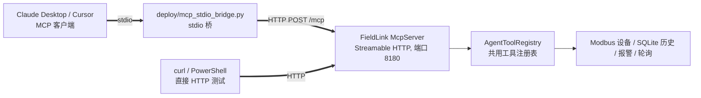

# FieldLink MCP 服务使用指南

> 分支：`mcp` ｜ 设计文档：[AI_AGENT_MCP_DESIGN.md](AI_AGENT_MCP_DESIGN.md)
>
> 本分支在 FieldLink 内部实现了一个 **MCP (Model Context Protocol) 服务器**，
> 让 Claude Desktop、Cursor 等 AI 客户端可以用自然语言直接操作你的 Modbus 采集系统。

---

## 一、架构



- **MCP 服务器内置于程序**（`src/mcpserver.cpp`），传输层为 Streamable HTTP（MCP 2025-06-18 规范），无状态模式
- **stdio 桥**（`deploy/mcp_stdio_bridge.py`，纯标准库）供只支持 stdio 传输的客户端使用
- **工具注册表**（`header/agenttool.h`）与 agent 分支的内嵌 AI 助手**共用**——工具定义一次，两端复用

## 二、启动服务

1. 启动 FieldLink，菜单 **Advanced → MCP Service (AI)**
2. 弹窗输入 **API Token**（留空 = 不鉴权，仅建议本机调试时使用）
3. 选择**是否允许写入**（写寄存器 / 新增报警规则 / 轮询控制）——默认禁止，这是安全闸门
4. 状态栏显示：`MCP 服务已启动 端口: 8180 工具: 11 写入: 关闭`

端口默认 8180，通过 `mcp/port` 配置项持久化；运行日志写入程序日志（Log Viewer 可查）。

## 三、直接 HTTP 测试（不借助 AI 客户端）

**PowerShell：**

```powershell
# 1. 握手
Invoke-RestMethod -Method Post -Uri http://127.0.0.1:8180/mcp -ContentType "application/json" -Body '{
  "jsonrpc":"2.0","id":1,"method":"initialize",
  "params":{"protocolVersion":"2025-06-18","capabilities":{},"clientInfo":{"name":"test","version":"0.1"}}}'
# 2. 列出工具
Invoke-RestMethod -Method Post -Uri http://127.0.0.1:8180/mcp -ContentType "application/json" -Headers @{"X-Api-Token"="你的Token"} -Body '{"jsonrpc":"2.0","id":2,"method":"tools/list"}'
# 3. 调用工具（读保持寄存器）
Invoke-RestMethod -Method Post -Uri http://127.0.0.1:8180/mcp -ContentType "application/json" -Headers @{"X-Api-Token"="你的Token"} -Body '{"jsonrpc":"2.0","id":3,"method":"tools/call","params":{"name":"get_system_status","arguments":{}}}'
```

**curl（Git Bash）：**

```bash
curl -s http://127.0.0.1:8180/mcp -H "Content-Type: application/json" \
  -d '{"jsonrpc":"2.0","id":1,"method":"initialize","params":{"protocolVersion":"2025-06-18","capabilities":{},"clientInfo":{"name":"test","version":"0.1"}}}'
```

说明：通知类消息（无 `id`，如 `notifications/initialized`）返回 HTTP 202 空体，这是规范行为。

## 四、接入 Claude Desktop（stdio 桥）

1. 确认 FieldLink 已启动 MCP 服务，并记下 Token
2. 编辑 Claude Desktop 配置文件 `claude_desktop_config.json`：

```json
{
  "mcpServers": {
    "fieldlink": {
      "command": "python",
      "args": [
        "C:\\Users\\Admin\\Desktop\\pros\\FieldLink-Modbus-DataAcquisition\\deploy\\mcp_stdio_bridge.py",
        "--port", "8180",
        "--token", "你设置的Token"
      ]
    }
  }
}
```

3. 重启 Claude Desktop，即可对话：

> 「帮我看看 FieldLink 现在的连接状态和活跃报警数」
> 「查一下 1 号设备最近一小时的历史数据，总结一下趋势」
> 「加一条报警规则：40001 大于 500 时报 Critical」（写入闸门开启时）

Cursor 等其他支持 MCP 的客户端配置方式类似（command = python，args 带桥脚本路径）。

## 五、工具清单（tools/list）

| 工具 | 作用 | 危险操作 |
| --- | --- | --- |
| `get_system_status` | 连接/轮询/报警/通信质量快照 | |
| `list_devices` | 设备列表与配置 | |
| `read_registers` | 读 Modbus 寄存器（自动入历史库） | |
| `write_registers` | **写寄存器** | ✅ |
| `query_history` | SQLite 历史查询（时间/从站/寄存器过滤） | |
| `get_recent_records` | 最近 N 条采集记录 | |
| `get_history_stats` | 历史库统计 | |
| `get_alarm_rules` | 报警规则列表 | |
| `get_alarm_history` | 报警事件历史 | |
| `add_alarm_rule` | **新增报警规则** | ✅ |
| `polling_control` | **启动/停止全部轮询** | ✅ |

危险工具受**写入闸门**控制：未开启时调用返回 `isError` 结果并提示原因，不会执行。
`registerType` 编号对应 Modbus 功能码：1=DiscreteInputs，2=Coils，3=InputRegisters，4=HoldingRegisters。

## 六、Resources 与 Prompts

**Resources**（`resources/read`）：

| URI | 内容 |
| --- | --- |
| `fieldlink://status` | 系统运行状态快照 |
| `fieldlink://devices` | 设备列表 |
| `fieldlink://alarms/rules` | 报警规则 |
| `fieldlink://alarms/history` | 最近报警事件 |
| `fieldlink://history/last` | 最近 100 条采集记录 |

**Prompts**（`prompts/get`）：`daily_report`（运行日报）、`troubleshoot`（故障排查）、`alarm_review`（报警规则体检）——都是指导 AI 分步调用工具的模板。

## 七、安全设计

- **Token 鉴权**：`Authorization: Bearer <token>` 或 `X-Api-Token` 头，与远程服务共用 `SecurityManager` 令牌体系
- **写入闸门**：三个危险工具默认不可用，启动服务时显式选择
- **审计**：写寄存器/报警规则/轮询控制全部写入 `SecurityManager` 审计日志（operator 记为 `mcp`）
- **DNS 重绑定防护**：非 localhost 的 Origin 头直接 403
- **参数校验**：所有工具参数按 JSON Schema 校验，缺失/类型不符直接拒绝

## 八、故障排查

| 现象 | 原因与处理 |
| --- | --- |
| 桥脚本报"无法连接" | FieldLink 未启动或未在菜单中开启 MCP 服务 |
| HTTP 401 | Token 不一致；桥 `--token` 参数与服务启动时输入的需一致 |
| HTTP 403 origin not allowed | 跨源访问被拦截，属预期防护 |
| 工具返回 isError「写入闸门未开启」 | 重新启动 MCP 服务并选择允许写入 |
| 工具返回「Modbus device not connected」 | 先在主界面连接设备（RTU/TCP） |
| 端口被占用 | 启动失败状态栏提示；换端口（`mcp/port` 配置项） |

## 九、与 agent 分支的关系

`AgentToolRegistry` 是两端共用的工具层：agent 分支的内嵌 AI 助手将复用这里的 11 个工具定义，
并在此基础上叠加 LLM Function Calling 循环与"写操作人工确认卡片"。在 mcp 分支调整工具时，
合并到 agent 分支后内嵌助手自动获得同样的能力。

---

*协议参考：[MCP Transports 规范 2025-06-18](https://modelcontextprotocol.io/specification/2025-06-18/basic/transports)*
